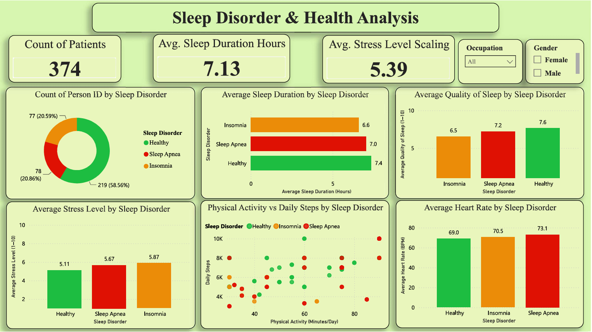
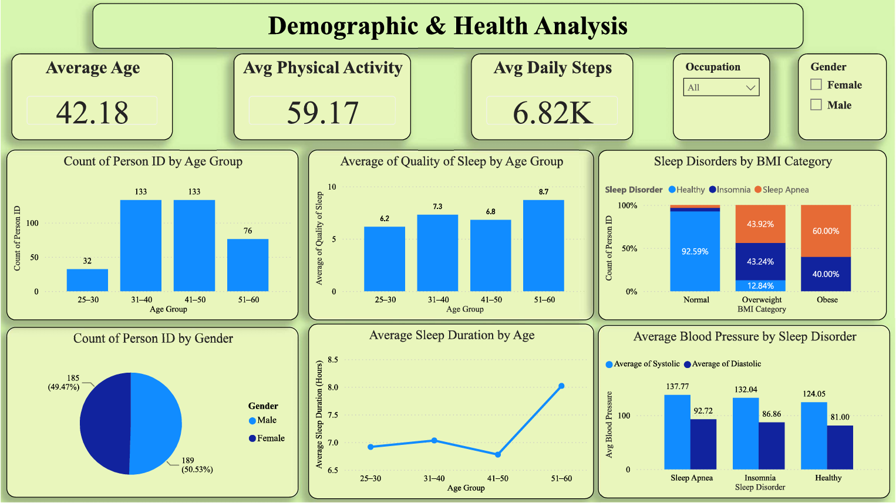

# 💤 Sleep Disorder Analysis & Power BI Dashboard

An interactive **Power BI dashboard** designed to analyze sleep patterns, lifestyle factors, and health indicators across individuals with different sleep-disorder categories.

The project explores relationships between **sleep duration, sleep quality, stress levels, physical activity, heart rate, blood pressure, BMI, age, occupation, and sleep disorders**.

---

## 📊 Project Overview

Sleep plays an important role in overall health and well-being. This project uses a dataset of **374 individuals** to explore patterns associated with sleep health and identify differences between three sleep-disorder categories:

* 🟢 Healthy
* 🟠 Insomnia
* 🔴 Sleep Apnea

The analysis was performed using **Python for data preparation and cleaning** and **Microsoft Power BI for visualization and dashboard development**.

---

## 🎯 Objectives

The main objectives of this project were to:

* Analyze the distribution of different sleep disorders.
* Compare sleep duration across sleep-disorder categories.
* Examine the relationship between stress levels and sleep disorders.
* Analyze heart rate and blood-pressure patterns.
* Explore the impact of physical activity and daily steps.
* Understand how age, gender, and occupation relate to sleep health.
* Build an interactive dashboard for exploring the dataset.

---

## 🗂️ Dataset

The dataset contains information about **374 individuals** and includes variables related to demographics, lifestyle, sleep, and health.

### Key Variables

| Category        | Variables                                          |
| --------------- | -------------------------------------------------- |
| 👤 Demographics | Age, Gender, Occupation                            |
| 😴 Sleep        | Sleep Duration, Sleep Quality, Sleep Disorder      |
| 🧠 Lifestyle    | Stress Level, Physical Activity Level, Daily Steps |
| ❤️ Health       | Heart Rate, Blood Pressure, BMI Category           |

The dataset was cleaned and prepared before being imported into Power BI.

---

## 🧹 Data Preparation

The data preparation process included:

* Handling missing values.
* Standardizing categorical values.
* Splitting the Blood Pressure field into **Systolic** and **Diastolic** values.
* Converting fields into appropriate data types.
* Checking inconsistencies in categorical variables.
* Preparing the dataset for analysis and visualization.

---

## 📈 Dashboard

The Power BI dashboard provides an interactive overview of sleep health and allows users to explore the data through different visualizations and filters.

### Key Performance Indicators

The dashboard includes KPIs such as:

* **Total Participants**
* **Average Sleep Duration**
* **Average Stress Level**
* **Average Age of Participants**
* **Average Daily Steps**

### Visualizations

The dashboard explores:

* Sleep Disorder Distribution
* Sleep Disorder by Gender
* Sleep Disorder by Occupation
* Average Sleep Duration by Sleep Disorder
* Average Stress Level by Sleep Disorder
* Blood Pressure Analysis
* Heart Rate Analysis
* Age Distribution

### Interactive Filters

Users can interact with the dashboard using slicers such as:

* Gender
* Occupation

This allows the analysis to be narrowed down to specific groups and makes it easier to identify patterns within the dataset.

---

## 🔍 Key Areas of Analysis

### Sleep & Health

The dashboard compares sleep duration and sleep quality across different sleep-disorder categories.

### Stress

Stress levels are analyzed to understand how they differ between individuals with different sleep conditions.

### Physical Activity

Daily steps and physical activity are explored as potential lifestyle factors associated with sleep health.

### Demographics

Age, gender, and occupation are analyzed to identify demographic patterns within the dataset.

### Cardiovascular Indicators

Heart rate and blood pressure are included to examine differences in health indicators across sleep-disorder categories.

---

## 🛠️ Tools & Technologies

* **Python**

  * Pandas
  * Data Cleaning
  * Data Preparation
* **Microsoft Power BI**

  * Data Visualization
  * Dashboard Development
  * Interactive Slicers
  * KPI Cards
* **Microsoft Excel / CSV**

  * Dataset storage and preparation


---

## 🚀 How to Use

### 1. Clone the repository

```bash
git clone https://github.com/username/sleep-disorder-analysis-powerbi.git
```

### 2. Open the Power BI file

Open:

```text
Sleep_Disorder_Dashboard.pbix
```

using **Microsoft Power BI Desktop**.

### 3. Explore the dashboard

Use the available slicers and visualizations to investigate sleep patterns, health indicators, demographics, and sleep-disorder categories.

---

## 💡 Skills Demonstrated

This project demonstrates practical experience in:

* Data Cleaning
* Exploratory Data Analysis
* Data Visualization
* Dashboard Design
* Power BI
* Pandas
* Handling Missing Values
* Data Transformation
* KPI Development
* Interactive Reporting
* Analytical Thinking
* Health Data Analysis

---

## 📌 Project Highlights

**Dataset:** 374 participants
**Sleep Categories:** Healthy, Insomnia, Sleep Apnea
**Primary Tool:** Microsoft Power BI
**Data Preparation:** Python / Pandas
**Dashboard Type:** Interactive Health Analytics Dashboard

---

## 📷 Dashboard Preview

Add a screenshot of the final dashboard here:

```markdown


```

---

## ⚠️ Disclaimer

This project is intended for **educational and analytical purposes only**. The patterns identified in the dataset should not be interpreted as medical advice or clinical conclusions.

---

## 👨‍💻 Author

**Anish Parulekar**

Data Analytics & Data Science Learner

[GitHub](https://github.com/anishparulekar972) • [LinkedIn](https://www.linkedin.com/in/anish-parulekar-a79b60262/)
